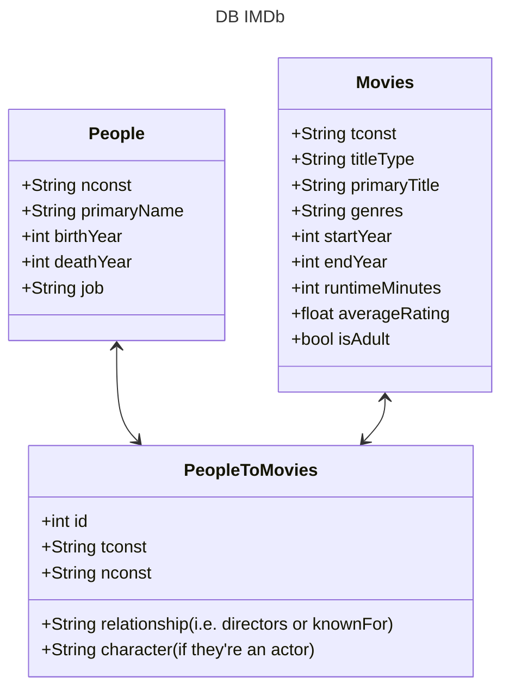

## Database Visual Plan

```mermaid
---
title: DB IMDb
---
classDiagram

    People <--> PeopleToMovies
    Movies <--> PeopleToMovies

    class Movies {
        +String tconst
        +String titleType
        +String primaryTitle
        +String genres
        +int startYear
        +int endYear
        +int runtimeMinutes
        +float averageRating
        +bool isAdult
    }
    class PeopleToMovies {
        +int id
        +String relationship (i.e. directors or knownFor)
        +String character (if they're an actor)
        +String tconst
        +String nconst
    }
    class People {
        +String nconst
        +String primaryName
        +int birthYear
        +int deathYear
        +String job
    }
```